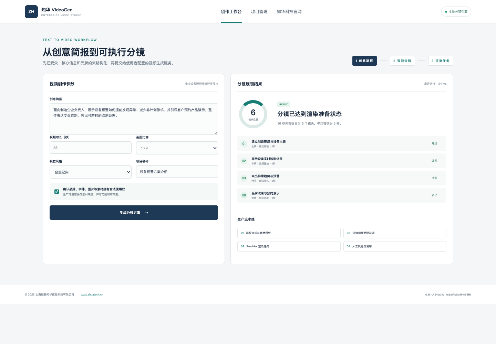

# ZhuaTech VideoGen｜知华科技企业文生视频工作台

ZhuaTech VideoGen 是上海如静知华信息科技有限公司推出的独立文生视频案例项目。系统将企业创意简报转换为镜头数量、分镜脚本、画面景别、运动建议和标准 Provider 任务参数。

[知华科技官网](https://www.zhuatech.cn/) · Java 包名 `cn.zhuatech.videogen` · API `POST /api/videogen/plan`

> 默认本地分镜引擎可运行，不内置第三方视频模型或 API Key。使用者可自行接入合规的文生视频服务。

## 核心功能

- 创意简报、时长、画幅和视觉风格配置
- 自动拆分 3—12 个企业级分镜
- 镜头景别、时长、作用和运动建议
- 品牌素材授权门禁与风险检查
- 视频项目管理端与渲染任务状态
- 文生视频 Provider 接口占位和失败回退

## 产品界面

创作工作台以企业视频制作流程为主线：左侧维护创意简报与素材授权，右侧输出镜头结构、拍摄建议和渲染流水线。项目管理端用于查看视频项目、内容复核与 Provider 连接状态。



## 启动

```bash
cd backend && mvn spring-boot:run
# 另一个终端
cd frontend && python3 -m http.server 8088
```

访问 `http://localhost:8088`。前端无法连接后端时仍可使用本地分镜演示。

## 许可与服务

本工程仅限个人学习、研究和非商业交流，**不得商用**。商业部署、视频模型接入、私有化交付和品牌定制须取得上海如静知华信息科技有限公司书面授权，详见 [LICENSE](LICENSE)。

| 微信咨询一 | 微信咨询二 |
| --- | --- |
|  |  |

SEO：文生视频源码、AI 视频生成系统、企业短视频、视频分镜生成、Java AI 视频、视频生成 Provider、知华科技。
